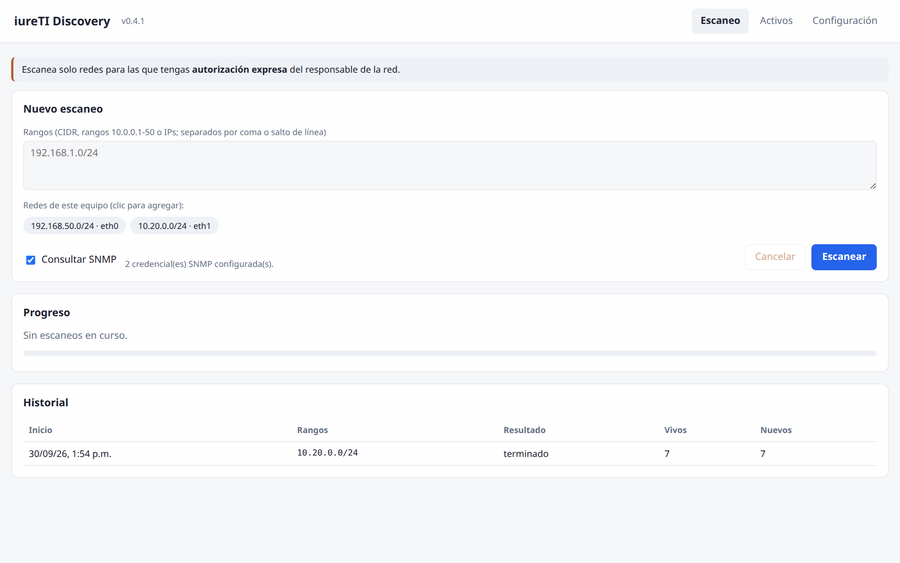
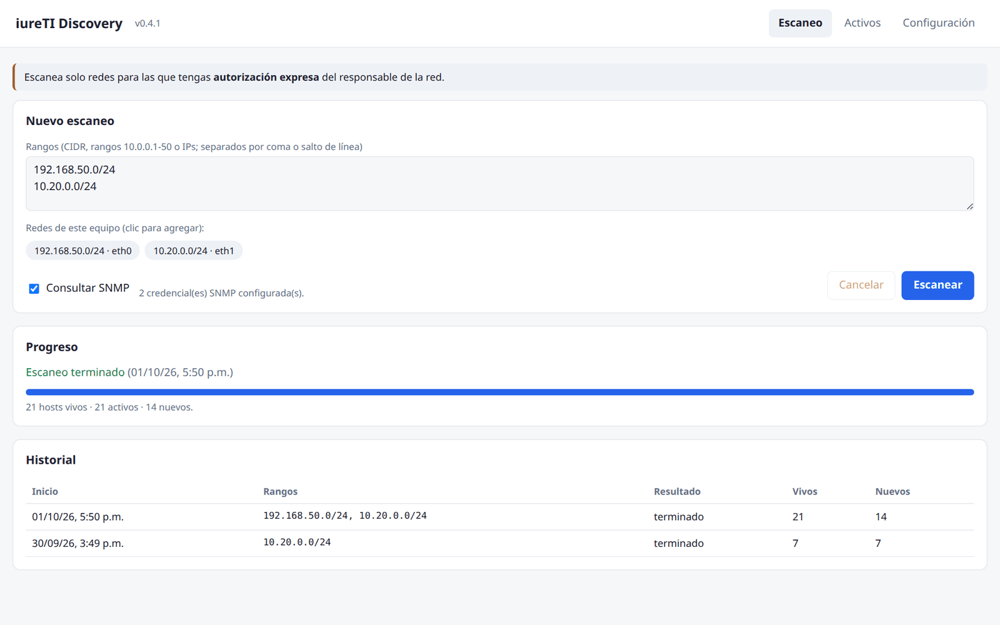
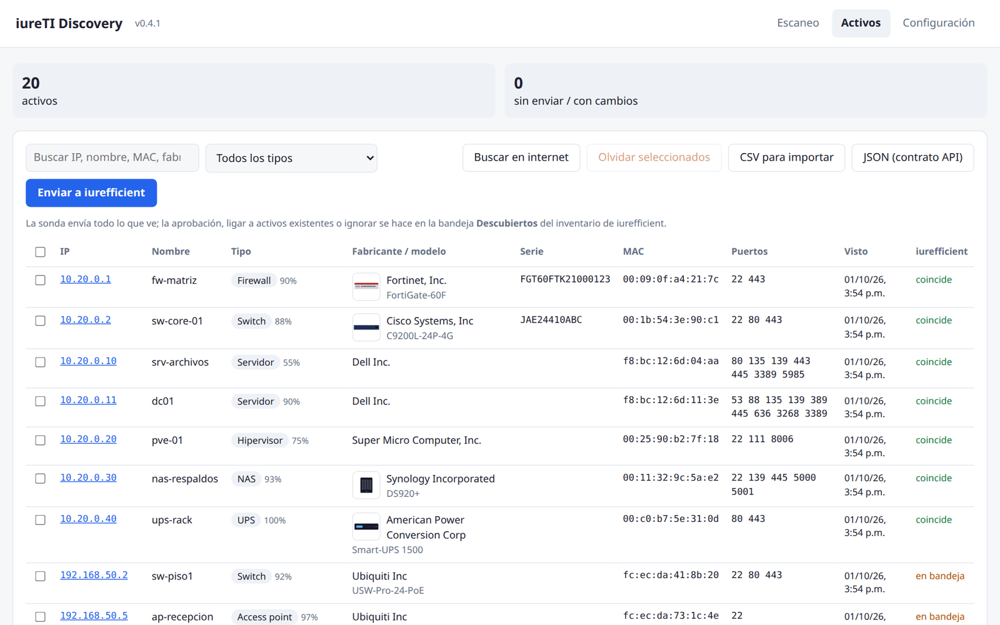
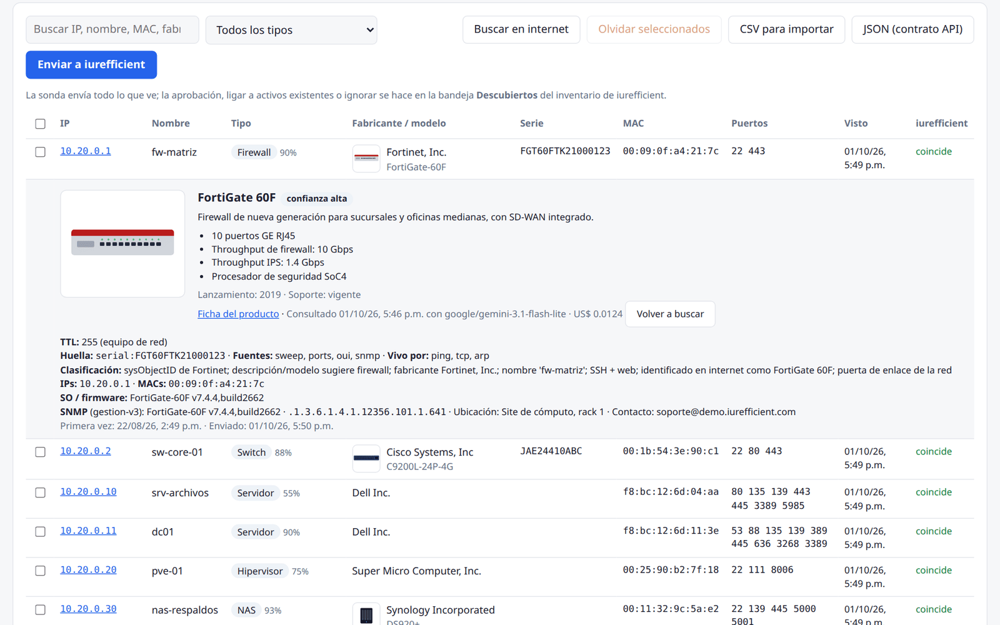
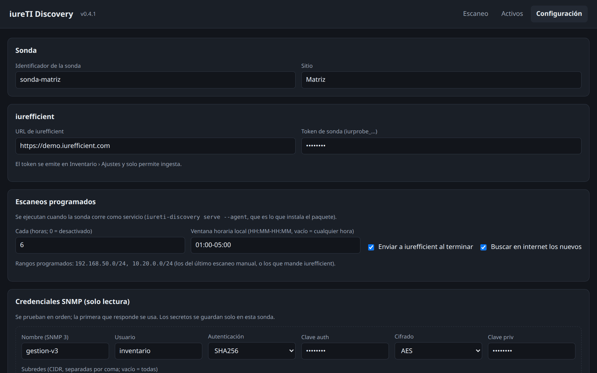

[Read in English](README.md)

<p align="center">
  <h1 align="center">iureTI Discovery</h1>
  <p align="center">Encuentra cada PC, servidor, switch, impresora y access point de tu red y mándalos al inventario de iurefficient, ya clasificados y listos para revisar.</p>
  <p align="center">
    <a href="https://github.com/ellaguno/iureTI/releases/latest"></a>
    <a href="https://github.com/ellaguno/iureTI/releases"></a>
    <a href="LICENSE"></a>
    
    <a href="https://github.com/ellaguno/iureTI/pkgs/container/iureti"></a>
    <a href="https://github.com/ellaguno/iureTI/actions/workflows/ci.yml"></a>
  </p>
  <p align="center"><b><a href="#instalar-una-sonda-servicio">Instalar en Linux (Debian · Ubuntu · Raspberry Pi OS · Docker)</a></b> · <a href="https://github.com/ellaguno/iureTI/releases/latest">Última versión</a></p>
</p>

<p align="center">
  
</p>

> Usa esta herramienta **solo en redes donde tengas autorización** expresa para hacerlo.

## ¿Por qué iureTI Discovery?

- **Un inventario que se arma solo.** Recorre tus rangos e identifica cada equipo con lo que ya anuncia
  (SNMP, mDNS, UPnP, NetBIOS, su propia página web, el fabricante de la MAC), en vez de que alguien llene una
  hoja de cálculo a mano.
- **Clasificado, no solo listado.** Cada activo recibe un tipo (PC, laptop, servidor, switch, firewall,
  impresora, access point, UPS, NAS…), un porcentaje de confianza y los motivos.
- **La decisión es tuya.** La sonda envía todo lo que ve a la bandeja **Descubiertos** del inventario de
  iurefficient; ahí se aprueba, se liga a activos existentes o se ignora.
- **Solo lectura y local.** Credenciales SNMP de solo lectura, interfaz web que escucha solo en `127.0.0.1`
  y credenciales que nunca salen de la sonda.
- **Corre donde corra Linux.** Un `.deb` con su propio Python para amd64 y arm64 (basta una Raspberry Pi), o
  una imagen Docker.

## Capturas

<table>
  <tr>
    <td width="50%"><br><sub>Elige los rangos (o da clic en las redes de la propia sonda) y sigue el escaneo fase por fase.</sub></td>
    <td width="50%"><br><sub>El inventario clasificado, con su estado en iurefficient después de enviarlo.</sub></td>
  </tr>
  <tr>
    <td width="50%"><br><sub>Ficha del activo: producto identificado en internet (opcional), datos SNMP y por qué se clasificó así.</sub></td>
    <td width="50%"><br><sub>Configuración (modo oscuro): conexión con iurefficient, escaneos programados y credenciales SNMP de solo lectura.</sub></td>
  </tr>
</table>

<sub>Todos los datos de las capturas y del GIF son ficticios.</sub>

## Funciones

- **Descubrimiento:** barrido ping/TCP y ARP, puertos abiertos, SNMP v2c/v3 (solo lectura; cada credencial se
  puede limitar a sus subredes), mDNS, UPnP/SSDP, NetBIOS, la página web del equipo y la base de fabricantes
  OUI del IEEE.
- **Clasificación y deduplicación:** tipo de equipo con confianza y motivos; el mismo equipo visto por varias
  fuentes (serie, MAC, hostname) queda como un solo activo.
- **Interfaz web local** (`iureti-discovery serve`, `http://127.0.0.1:8765/`) y **línea de comandos** para
  escanear, exportar y enviar.
- **Integración con iurefficient:** envío a la API de ingesta del inventario, o exportación a CSV para
  *Inventario › Importar* o a JSON con el contrato de la API.
- **Modo servicio** (`serve --agent`, lo que instala el paquete): heartbeat con iurefficient, configuración
  remota, escaneos programados dentro de una ventana horaria y envío automático después de cada escaneo.
- **Identificación por internet (opcional, desactivada por omisión):** un modelo de IA con búsqueda web
  (OpenRouter o Anthropic) encuentra el nombre comercial, descripción, ficha técnica y foto de cada modelo de
  producto.

## Instalar una sonda (servicio)

Debian / Ubuntu / Raspberry Pi OS, amd64 o arm64:

```bash
curl -fsSL https://github.com/ellaguno/iureTI/releases/latest/download/install.sh | sudo sh -s -- \
  --url https://cliente.iurefficient.com --token iurprobe_xxxxx --site "Matriz"
```

O con Docker (red del host): `docker run -d --name iureti --network host --restart unless-stopped -v iureti-data:/data ghcr.io/ellaguno/iureti:latest`.

`install.sh` descarga el `.deb` del último release, **verifica su SHA-256**, lo instala con `apt` y registra la
sonda si se dan `--url`/`--token`; volver a correrlo actualiza. Detalles (Docker Compose junto a un
iurefficient on‑premise, actualizaciones, dónde va la sonda) en [docs/07](docs/07-distribucion.md).

La sonda tiene que estar **dentro** de la red que descubre y solo hace conexiones salientes. No corre en
Windows ni en WSL2 (no ven la red de la oficina); para sitios solo‑Windows, una Raspberry Pi o una VM Linux
pequeña.

## Inicio rápido (desarrollo)

Requiere Linux, Python 3.11+ y [uv](https://docs.astral.sh/uv/). No requiere root.

```bash
git clone https://github.com/ellaguno/iureTI.git && cd iureTI
uv sync
uv run iureti-discovery oui-update          # base de fabricantes por MAC (IEEE)
uv run iureti-discovery serve --open        # interfaz web en http://127.0.0.1:8765/
```

Desde la terminal:

```bash
uv run iureti-discovery networks                          # redes de este equipo
uv run iureti-discovery scan 192.168.1.0/24 --community public
uv run iureti-discovery export --format csv -o activos.csv # para Inventario › Importar
export OPENROUTER_API_KEY=sk-or-...                        # o ANTHROPIC_API_KEY con --provider anthropic
uv run iureti-discovery enrich --enable                     # identifica productos en internet (IA + búsqueda web)
uv run iureti-discovery enrich --model deepseek/deepseek-v4-flash   # cambiar de modelo
uv run iureti-discovery sync                               # envía a iurefficient (URL y token en la configuración)
```

La interfaz escucha solo en `127.0.0.1`. En un servidor sin escritorio, usa un túnel SSH
(`ssh -L 8765:127.0.0.1:8765 servidor`) en vez de exponerla en la red.

## Seguridad y privacidad

Resumen de [docs/05 — Seguridad y operación](docs/05-seguridad.md):

- **La interfaz web escucha solo en `127.0.0.1:8765`.** La API comprueba la cabecera `Host` (DNS rebinding),
  exige una cabecera propia en cada petición (CSRF) y responde con una CSP estricta. Si la expones con
  `--host 0.0.0.0` se genera un token de interfaz obligatorio; aun así, lo recomendado es un túnel SSH.
- **Qué se envía a iurefficient y cuándo:** solo si configuras su URL y el token de sonda. Los activos
  descubiertos (tipo, hostname, IPs, MACs, fabricante, modelo, serie, SO, puertos, ubicación, descripción y
  contacto SNMP, motivos de la clasificación y el resumen del producto) se envían al pulsar *Enviar a
  iurefficient*, con `sync` o después de cada escaneo programado si el envío automático está activo. En modo
  servicio la sonda manda además un heartbeat cada 5 minutos por omisión (nombre, versión, sitio, hostname,
  SO, estado del escaneo y del envío, sus redes). Las credenciales SNMP y las claves de IA nunca se envían.
- **Rangos acotados:** deben caer dentro de las redes privadas más las propias de la sonda (o la lista que
  fijes), así que un iurefficient comprometido no puede hacer que la sonda escanee internet.
- **La identificación por internet está desactivada por omisión.** Si la activas, solo viajan datos del
  **producto** a OpenRouter (y al proveedor del modelo elegido; la sonda pide proveedores que no guardan ni
  entrenan con los datos) o a Anthropic: marca, modelo, SO/firmware, lo que el equipo anuncia por
  SNMP/UPnP/mDNS/web y sus puertos abiertos. Nunca IPs, MACs, hostnames, números de serie, ubicaciones ni
  nombres que pone el usuario; además se borran de todos los campos de texto antes de enviar.
- **Otras conexiones:** la descarga de la base OUI del IEEE cuando la pides. Sin telemetría.
- El servicio corre como el usuario sin privilegios `iureti` con endurecimiento de systemd; la base local
  tiene permisos `600`. Los releases llevan atestación de procedencia (`gh attestation verify …`).

## Documentación

- [Visión y factibilidad](docs/01-vision-factibilidad.md)
- [Fuentes de descubrimiento](docs/02-fuentes-descubrimiento.md)
- [Arquitectura](docs/03-arquitectura.md)
- [Contrato de la API de ingesta](docs/04-api-ingesta.md)
- [Seguridad y operación](docs/05-seguridad.md)
- [Roadmap](docs/06-roadmap.md)
- [Distribución e instalación](docs/07-distribucion.md)
- [Integración con iurefficient](docs/08-integracion-iurefficient.md)

## Parte de la suite Iurefficient

| App | Qué hace |
|---|---|
| [IureTranscribe](https://github.com/ellaguno/iuretranscribe) | Transcripción local con Whisper, grabación en vivo con quién habló, resumen y minuta. |
| [iureditor](https://github.com/ellaguno/iureditor) | Editor Markdown WYSIWYG con Mermaid, LaTeX y exportación a PDF/DOCX. |
| [IureDav](https://github.com/ellaguno/iuredav) | Monta un servidor WebDAV (o Iurefficient) como unidad. |
| [IureOCR](https://github.com/ellaguno/iureocr) | OCR local que convierte escaneos en PDF con texto buscable. |
| **iureTI** | Sonda de descubrimiento de activos de TI para el inventario de Iurefficient. |

## Contribuir

Los issues y pull requests son bienvenidos. Buenas primeras contribuciones: reportes de errores con el
registro del servicio (`journalctl -u iureti-discovery`) o la salida del comando, mejores reglas de
clasificación para equipos que quedan con el tipo equivocado, traducciones (hoy la interfaz solo está en
español) y documentación. Ve [Desarrollo](#desarrollo) para correr las pruebas.

Corre la sonda, y cualquier prueba que hagas con ella, solo en redes que tengas autorización para escanear.

## Desarrollo

```bash
uv run pytest
```

<details>
<summary>Compilación, versiones y regenerar las imágenes del README</summary>

- Construir el `.deb` localmente: `docker run --rm -v "$PWD":/src -w /src debian:12 bash packaging/build-deb.sh` (→ `dist/`).
- Versiones: un tag `vX.Y.Z` corre `.github/workflows/release.yml`: pruebas → `.deb` amd64 y arm64 (construidos
  en `debian:12` y probados en Ubuntu 22.04/24.04 limpios) → imagen multi‑arquitectura en
  `ghcr.io/ellaguno/iureti` → Release con los `.deb`, sus `.sha256`, `SHA256SUMS` e `install.sh`. Atestación de
  procedencia del `.deb` y de la imagen.
- Dónde guarda las cosas: `~/.local/share/iureti-discovery/iureti.db` y `~/.cache/iureti-discovery/` a mano;
  `/var/lib/iureti/` y `/var/cache/iureti/` como servicio; `/data` en Docker.
- GIF y capturas del README: `scripts/readme-media/run.sh` (interfaz web real, datos ficticios, sin escanear
  ninguna red). Ver [scripts/readme-media/README.md](scripts/readme-media/README.md).

</details>

## Licencia

[Apache License 2.0](LICENSE). Ver también [NOTICE](NOTICE): la licencia no otorga derechos sobre los
nombres «iureTI» e «iurefficient».
